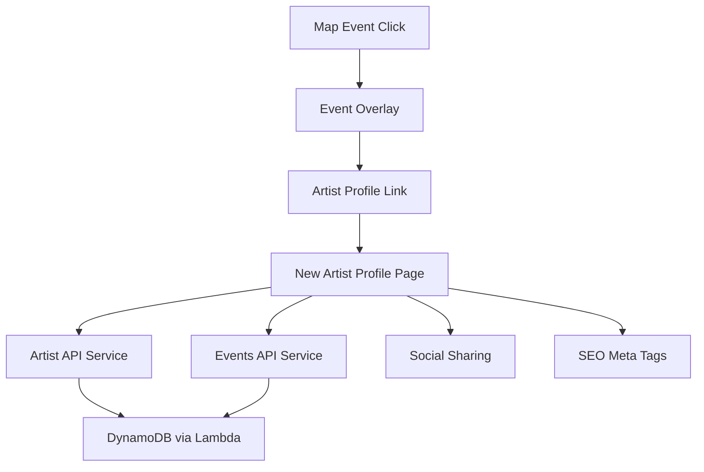

# Artist Public Profile - Design Document

## Overview

The Artist Public Profile feature will replace the existing complex artist profile implementation with a clean, public-focused page optimized for discovery and sharing. The new design prioritizes simplicity, performance, and social sharing while maintaining integration with the existing bndy ecosystem.

## Architecture

### High-Level Architecture



### Data Flow

1. **Discovery Flow**: User discovers artist through map events
2. **Profile Loading**: Clean profile page loads artist data from existing APIs
3. **Event Integration**: Shows upcoming events for the artist
4. **Social Integration**: Displays external platform links
5. **Sharing**: Optimized for social media sharing with proper meta tags

## Components and Interfaces

### Page Structure

The new artist profile page will be located at `/src/app/artists/[artistId]/page.tsx` and will replace the existing implementation entirely.

#### Core Components

1. **ArtistProfileHeader**
   - Artist name and profile image
   - Genre tags (if available)
   - Social media links (YouTube, Spotify, Facebook, Instagram, X, Website)
   - Clean, mobile-first design

2. **ArtistBio**
   - Artist description/bio text
   - Collapsible for long descriptions
   - Only shown if bio exists

3. **UpcomingEvents**
   - List of upcoming events for the artist
   - Event cards with date, venue, and basic info
   - Click to view event details
   - "No events" state when empty

4. **ShareSection**
   - Social sharing buttons
   - Copy link functionality
   - Optimized for mobile sharing

### API Integration

#### Artist Data Retrieval
- Use existing `getArtistById()` function from artist-service.ts
- Fallback handling for missing data
- Error states for non-existent artists

#### Events Data Retrieval
- Use existing `getEventsForArtist()` function from event-service.ts
- Filter to show only upcoming events
- Sort chronologically

### Responsive Design

#### Mobile-First Approach
- Stack layout on mobile
- Optimized touch targets
- Fast loading on mobile networks

#### Desktop Enhancements
- Side-by-side layout for content
- Larger images and text
- Enhanced social sharing options

## Data Models

### Artist Profile Data Structure

```typescript
interface ArtistProfileData {
  id: string;
  name: string;
  description?: string;
  profileImageUrl?: string;
  genres?: string[];
  socialMediaURLs?: SocialMediaURL[];
  upcomingEvents: Event[];
}
```

### Social Media Integration

```typescript
interface SocialMediaURL {
  platform: 'website' | 'spotify' | 'facebook' | 'instagram' | 'youtube' | 'x';
  url: string;
}
```

## Error Handling

### Error States

1. **Artist Not Found (404)**
   - Clean 404 page with navigation back to map
   - Suggestion to search for similar artists

2. **Loading States**
   - Skeleton loading for profile header
   - Progressive loading for events section
   - Graceful degradation for slow connections

3. **API Failures**
   - Retry logic for transient failures
   - Fallback to cached data where possible
   - User-friendly error messages

### Performance Considerations

- **Image Optimization**: Next.js Image component with proper sizing
- **Lazy Loading**: Events section loads after profile header
- **Caching**: Leverage existing API caching strategies
- **Bundle Size**: Minimal dependencies, reuse existing components where possible

## Testing Strategy

### Unit Testing
- Component rendering tests
- API integration tests
- Error handling tests
- Social sharing functionality tests

### Integration Testing
- End-to-end user flow from map to profile
- Cross-browser compatibility
- Mobile responsiveness testing
- Social sharing validation

### Performance Testing
- Page load time optimization
- Mobile network performance
- Image loading optimization
- API response time monitoring

## SEO and Social Sharing

### Meta Tags Implementation

```typescript
interface ProfileMetaTags {
  title: string; // "Artist Name | bndy"
  description: string; // Artist bio or default description
  ogImage: string; // Artist profile image or default
  ogUrl: string; // Canonical profile URL
  twitterCard: 'summary_large_image';
}
```

### URL Structure
- Clean URLs: `/artists/[artistId]`
- SEO-friendly artist names in URL where possible
- Canonical URLs for duplicate content prevention

### Open Graph Implementation
- Artist name and image in social previews
- Event information in description
- Proper image sizing for different platforms

## Migration Strategy

### Replacement Approach

1. **Create New Implementation**
   - Build new profile page alongside existing one
   - Use different route temporarily for testing

2. **Data Compatibility**
   - Ensure compatibility with existing Artist data structure
   - Reuse existing API endpoints
   - Maintain backward compatibility

3. **Gradual Rollout**
   - Feature flag for new vs. old profile
   - A/B testing capabilities
   - Rollback plan if issues arise

4. **Complete Replacement**
   - Remove old implementation
   - Update all links to use new profile
   - Clean up unused components

## Security Considerations

### Public Data Only
- No sensitive artist information exposed
- No edit capabilities on public profile
- Rate limiting on API endpoints

### Input Validation
- Sanitize artist bio content for XSS prevention
- Validate social media URLs
- Proper error handling for malformed data

## Accessibility

### WCAG Compliance
- Proper heading hierarchy
- Alt text for all images
- Keyboard navigation support
- Screen reader compatibility
- Color contrast compliance

### Progressive Enhancement
- Core functionality works without JavaScript
- Enhanced features with JavaScript enabled
- Graceful degradation for older browsers